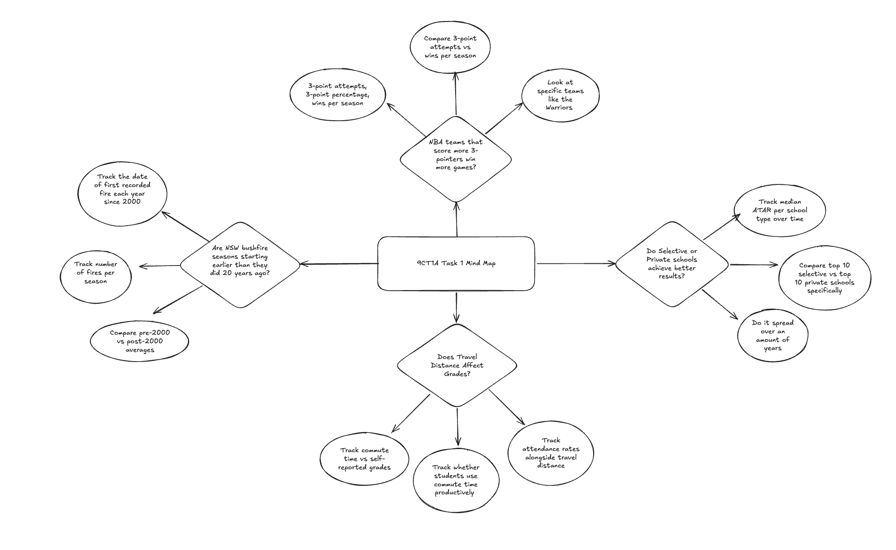

# Assessment Task 1

Research Question: Do selective, private or public schools achieve higher scores in the HSC (NSW 2023-2025)?

Hypothesis: Selective schools achieve higher average HSC results than other school types.

---

## Phase 1: Identifying and Defining

### Functional Requirements

Data Loading: The system loads a CSV file (schoolrank.csv) containing NSW HSC school ranking data from 2023-2025. It handles missing values using pandas 
pd.to_numeric(errors='coerce').

Data Cleaning: The system handles missing values in the 2023 and 2024 ranking columns. Data can be filtered by school type (selective, private or 
public).

Data Analysis: The system calculates mean success rates grouped by school type to test the hypothesis. It also calculates average rankings across 3 years.

Data Visualisation: Three matplotlib charts: a bar chart of top 10 schools, a pie chart comparing school types, and a bar chart of average rankings 
2023-2025.

Data Reporting: Results are displayed in the terminal. Charts are saved as chart.png. Updated data is saved back to schoolrank.csv.

### Non-Functional Requirements

Usability: Text-based menu with numbered options 1-8. A typewriter effect is used on the welcome screen to make it more interesting and aesthetic. Clear labels and prompts guide the user through each option.

Reliability: Invalid menu selections show an error message. Search returns "No school found" if nothing matches or if there is an incorrect spelling.

### Use-Case

Actor: User

Goal: To access and interact with NSW HSC school ranking data (2023-2025) through the program's text-based menu.

Preconditions:
- schoolrank.csv has been loaded into the Data/ folder
- The user runs main.py in the terminal
- pandas and matplotlib are installed

Main Flow:
1. User runs the program and sees the welcome message and numbered menu.
2. User selects one of the following options:
   - View hypothesis and see if selective schools do better than private schools
   - View the full dataset
   - View summary statistics (total schools, average success rate)
   - Search for a specific school by name
   - View one of three charts (top 10, school type comparison, 3 year average)
   - Compare 2 schools 
   - See if a schools ranking went up, down or stayed the same from 2024-2025
3. System performs the action and displays the result in the terminal. Charts are saved as chart.png.

Postconditions:
- User has viewed and or interacted with the data
- Full Data remains available for any other reasons

---

## Phase 2: Research and Planning

### Data Dictionary

| Field | Datatype | Format | Description | Example | Validation |
|-------|----------|--------|-------------|---------|------------|
| School | str | XX…XX | Name of the school | Gosford High School | No numbers allowed |
| 2025 School Ranking | int64 | NNN | Ranking in 2025 | 33 | Whole number, greater than 0 |
| 2024 School Ranking | int64 | NNN | Ranking in 2024 | 53 | Whole number, can be missing |
| 2023 School Ranking | int64 | NNN | Ranking in 2023 | 64 | Whole number, can be missing |
| Success Rate (%) | float64 | NN.NN | % of HSC entries scoring Band 6 | 33.84 | Decimal between 0 and 100 |
| HSC Students | int64 | NNN | Students who sat the HSC | 165 | Whole number, greater than 0 |
| Total HSC Entries | int64 | NNNN | Total HSC exam entries | 993 | Whole number, greater than 0 |
| High Scores | int64 | NNN | Number of Band 6 results | 336 | Cannot exceed Total HSC Entries |
| Type of School | str | XX…XX | Category of school | Selective | Must be Selective, Private, Public, or Partially Selective |

---

## Phase 4: Testing and Evaluating

### Analyse and Conclude

#### SEE-I Paragraph

Statement: Selective schools achieve significantly higher HSC success rates than private and public schools in NSW, strongly supporting the hypothesis.

Elaborate: This is likely because selective schools admit students solely based on academic ability through a competitive entry exam, meaning every student who enters has already demonstrated above average ability before starting high school. This creates a learning environment where everyone is motivated and competitive, giving selective schools a structural advantage that private schools cannot match despite having more funding and resources, and that public schools cannot match as they must accept all students in their local area regardless of ability.

Example: After analysing 149 (not including the unknown ones) NSW schools from 2023 to 2025, my program calculated that selective schools averaged a success rate of 37.84% compared to just 24.19% for private schools, a gap of over 13%. The top 8 ranked schools in 2025 were all selective, with North Sydney Boys leading at 71.6% and James Ruse at 70.43%, far ahead of the top private school Sydney Grammar at 60.99%. Even mid ranked selective schools like Gosford High School ranked 33rd outperformed many expensive and well known private schools.

Illustrate: So basically/simply, out of every 100 HSC exam entries from a selective school, approximately 38 would achieve Band 6, compared to only 24 from a private school. Think of it like a sports team that only selects the top athletes in the state, of course that team will win more games than one that accepts anyone who can pay the registration fee. Selective schools operate on this same principle, and the the data I used proves it consistently.

### Conclusion

My hypothesis is supported. Selective schools perform significantly better than private and public schools based on 2023-2025 NSW data, with an average success rate 13.65%  higher than private schools. However this may simply reflect the fact that selective schools start with stronger students rather than being better schools overall.

### Evaluate Your Project

#### In relation to Requirements Outline
The system successfully meets all functional requirements defined in the initial design specification. The CSV file loads correctly, missing values are handled, and all three charts save successfully. The menu works correctly and shows an error message if the user types something invalid.

#### In relation to Peer Feedback
Friend-Mrigaank

Plus-Variety of Functions that work and display different graphs

Minus-The charts/graphs are not displayed automatically and are saved as chart.png to view 

Implication-Use more matplotlib for graph printing

#### In relation to Project Management
The project was completed in order across all 4 phases. Having a plan in Phase 1 made the coding in Phase 3 much easier. More time could have been spent on making the charts look better and adding more aesthetic improvements to the menu.

#### In relation to Data and Security
The data came from Matrix Education's 2025 NSW High School Rankings which uses official HSC results, so it is accurate and reliable. However it only covers 3 years and only measures Band 6 results, not how much students improved. 

(https://www.matrix.edu.au/2025-high-school-rankings/) 

Security could be better by adding a password to stop people changing the data. 

# Mind Map

# Evaluation
### 1. Evaluation in relation to Requirements Outline

The system meets most of the requirements from the outline. It can load a dataset of schools, search for specific schools, compare results, show ranking changes, and display visual graphs.

The system successfully:

- Displays summary statistics (success rate, number of schools)
- Allows searching for a school by name
- Compares two schools
- Shows ranking changes over time
- Produces visualisations (bar charts and pie charts)

However, there are some limitations:

- In the compare schools option search results only return the first match if multiple schools match
- Some features depend on clean data (missing values could make results incorrect)

Overall, the system meets the most requirements but could be improved in error handling and flexibility or more options to provide better results.

### 2. Evaluation in relation to peer feedback

Peer feedback (Mrigaank) showed that the system is:

- Easy to use with simple input prompts
- Helpful for comparing schools quickly
- Clear in displaying rankings and success rates

However, Mrigaank suggested improvements:

- Make graphs open automatically instead of saving the files as a png (I fixed this one)
- Allow better search results (e.g. showing multiple schools more clearly)
- Add more interactive features or filters

These suggestions helped improve usability and guided changes like using plt.show() instead of saving images.

### 3. Evaluation in relation to project management

The project was managed in stages:

Planning: Defined features like search, comparison, and graphs

Development: Built each function separately and tested them

Testing: Checked outputs using different school names and inputs

Improvement: Refined code based on errors and feedback

Strengths:

Code was structured into separate functions
Features were built step-by-step
Easy to debug because each function is independent

Weaknesses:

- Some features were added late and not fully polished
- Limited time for other improvements for the comparison and school rank up or down.

Overall, project management was effective but could be improved with earlier testing and planning of edge cases.

### 4. Evaluation of data and security
Data validity, accuracy, and timelinessThe dataset appears mostly valid and structured correctly (schools, rankings, success rates). Accuracy depends on the original source of the data (assumed to be correct school performance data).The data may not be fully timely if it is not updated yearly.

The data may be biased because:
- It compares selective vs private schools, which have different entry requirements
- Success rate does not account for student background or resources
- This means conclusions should be interpreted carefully.

### 5. Security and improvements

Current system security is basic because:

It only reads a local CSV file
No user accounts or sensitive personal data are stored

Possible improvements:

- Validate user input more strictly (prevent invalid search inputs)
- Ensure dataset file cannot be accidentally modified by users

### 6. UX (User Experience) and accessibility improvements

The UX is simple but could be improved:

Improvements:

- Improve readability of outputs (better spacing and formatting especially the data set)
- Add error messages that are more user friendly

Accessibility could also be improved by:

- Using larger labels in graphs
- Avoiding dense text outputs
- Ensuring clear instructions at each step